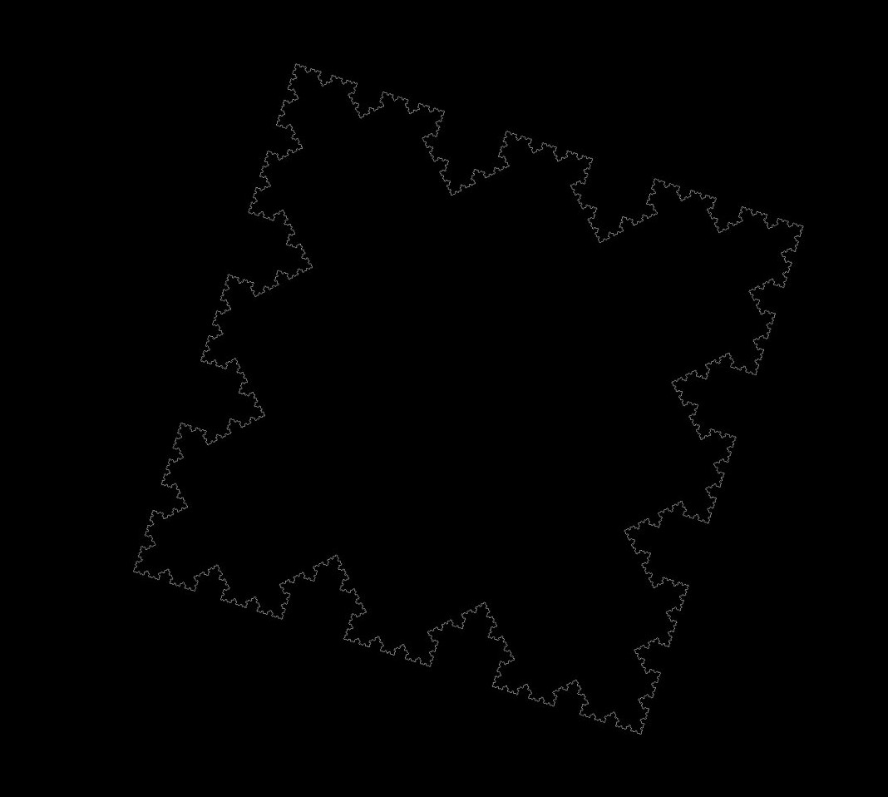
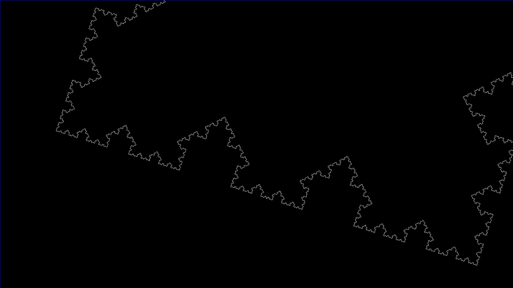
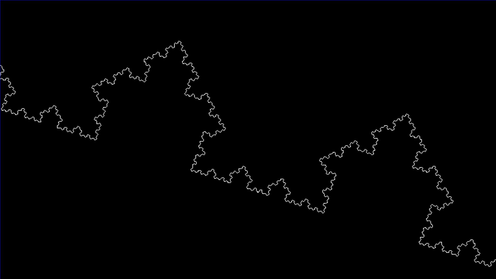

# Fractal-view

`pip install -r requirements.txt`

`./main.py 1`

argv: 1 - 7

# Control

#### Mouse Click: move,  Mousewheel: Zoom

#### Shift: draw, Space: direct line

#### Left <- A   D -> Right

#Screenshot

# Created by Alexander Komyakov
For any kind of help, support, suggetion and request ask in me
## Follow on:

